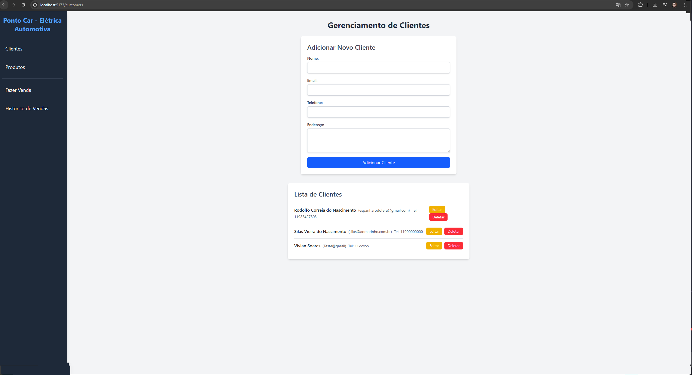
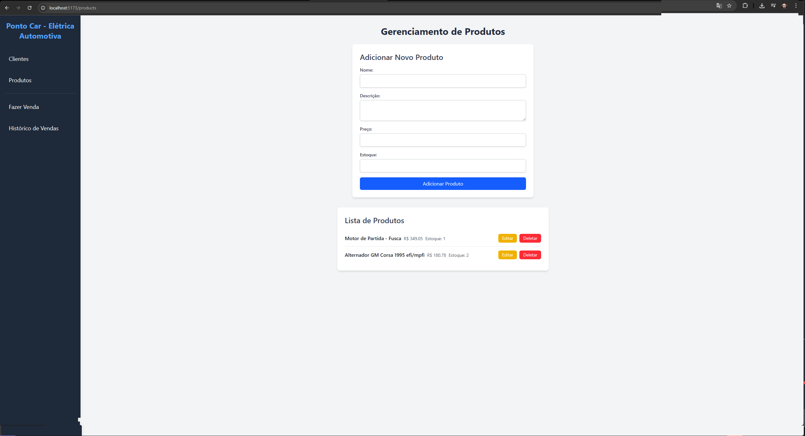
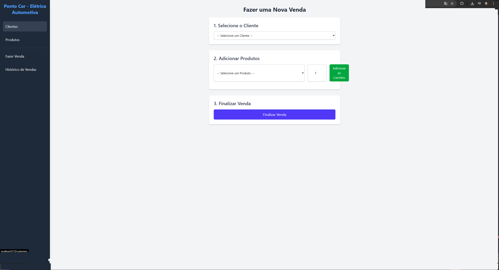
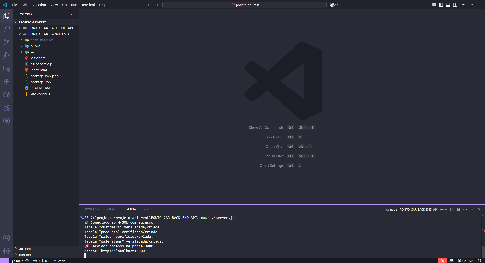

🚗 Projeto API Rest — Sistema para Oficina Automotiva
Este projeto é uma aplicação web fullstack voltada para o gerenciamento de uma oficina de automóveis, permitindo cadastrar clientes, gerenciar produtos e realizar vendas com praticidade e performance.

✨ Tecnologias Utilizadas
💻 Frontend
⚛️ React.js: Biblioteca JavaScript para interfaces de usuário.

⚡ Vite: Ferramenta de build rápida e moderna.

🎨 Tailwind CSS: Framework CSS utilitário para estilização responsiva.

🧱 HTML5: Estruturação semântica das páginas web.

🌐 Backend
🟢 Node.js: Ambiente para execução de JavaScript no servidor.

🚂 Express.js: Framework web minimalista para APIs RESTful.

🗄️ Banco de Dados
🐬 MySQL: Sistema gerenciador de banco de dados relacional.

🔧 XAMPP: Ambiente de desenvolvimento com Apache, MySQL, PHP e Perl.

🧰 Funcionalidades
📇 Cadastro de clientes com informações detalhadas.

📦 Registro e gerenciamento de produtos.

🛒 Controle de vendas com interface amigável.

🔍 Busca rápida de clientes e produtos.

📊 Painel intuitivo para facilitar a visualização de dados.

📸 Imagens do Projeto

  
 
  
 
  
 
  

🚀 Como Executar o Projeto
Pré-requisitos
Node.js instalado

MySQL e XAMPP configurados

Gerenciador de pacotes (npm ou yarn)

Backend

# Acesse a pasta do backend
cd backend

# Instale as dependências
npm install

# Inicie o servidor
npm start
Frontend

# Acesse a pasta do frontend
cd frontend

# Instale as dependências
npm install

# Inicie a aplicação
npm run dev
